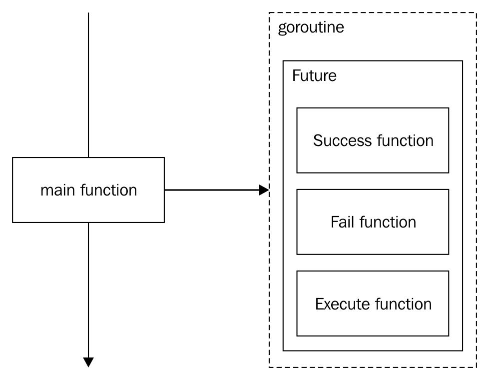

# Future Pattern

The Future design pattern (also called Promise) is a quick and easy way to achieve
concurrent structures for asynchronous programming.

In short, we will define each possible behavior of an action before executing them in
different Goroutines. Node.js uses this approach, providing event-driven programming by default. The idea here is to achieve a _fire-and-forget_ that handles all possible results in an action.

To understand it better, we can talk about a type that has embedded the behavior in case an execution goes well or in case it fails.

    

In the preceding diagram, the main function launches a Future within a new Goroutine. It won't wait for anything, nor will it receive any progress of the Future. It really fires and forgets it.

The interesting thing here is that we can launch a new Future within a Future and embed as many Futures as we want in the same Goroutine (or new ones). The idea is to take advantage of the result of one Future to launch the next. For example:

    

Here, we have the same Future. In this case, if the Execute function returned a correct result, the Success function is executed, and only in this case we execute a new Goroutine with another Future inside (or even without a Goroutine).

This is a kind of lazy programming, where a Future could be calling to itself indefinitely or just until some rule is satisfied. The idea is to define the behavior in advance and let the future resolve the possible solutions.